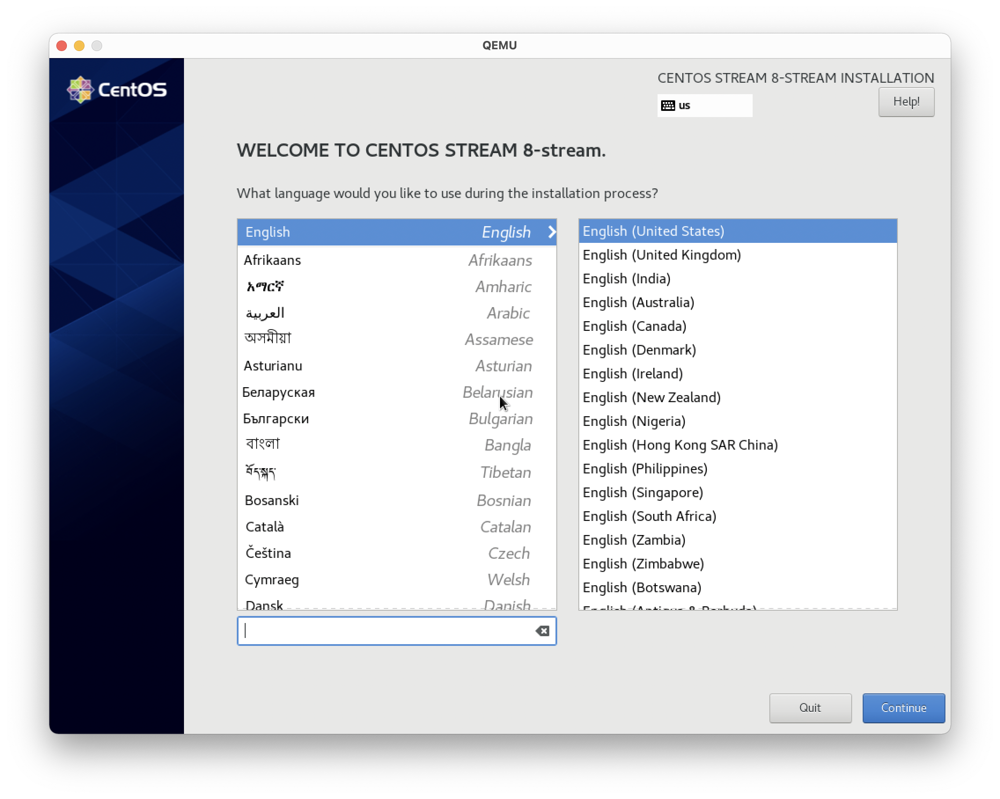

# Virtualization

- [Virtualization](#virtualization)
  - [Preface](#preface)
  - [Getting QEMU ready](#getting-qemu-ready)
    - [Check KVM support](#check-kvm-support)
    - [Install Qemu dependencies](#install-qemu-dependencies)
    - [Install Qemu from source](#install-qemu-from-source)
  - [Getting VM ready](#getting-vm-ready)
    - [Install CentOS8](#install-centos8)
      - [Command args explained](#command-args-explained)
    - [SSH to CentOS8 virtual machine](#ssh-to-centos8-virtual-machine)
  - [OpenVSwitch DPDK](#openvswitch-dpdk)
    - [Get DPDK](#get-dpdk)
    - [OpenVSwitch configuration](#openvswitch-configuration)
    - [Creating OpenVSwitch port and bridge](#creating-openvswitch-port-and-bridge)
    - [Relaunch QEMU with vhost-user support](#relaunch-qemu-with-vhost-user-support)
  - [Network Profiling](#network-profiling)
    - [iperf result](#iperf-result)
      - [virtio](#virtio)
      - [vhost](#vhost)
    - [ping test result](#ping-test-result)
      - [virtio](#virtio-1)
      - [vhost](#vhost-1)
    - [Summary of experiment result](#summary-of-experiment-result)
  - [Multi-Queue](#multi-queue)
  - [Live Migration](#live-migration)
  - [Appendix - convenient setup script](#appendix---convenient-setup-script)

## Preface

The experiment is carried out on a host with Ubuntu 20.04 LTS (x86_64), i7-9700K, 32GB RAM, bare metal.

We first build QEMU from source, then install DPDK and OpenVSwitch with DPDK enabled. Then we carry out our experiment.

## Getting QEMU ready

### Check KVM support

We should first check the KVM support. KVM is a Linux kernel feature.

```bash
$ lsmod | grep kvm
kvm_intel             294912  0
kvm                   819200  1 kvm_intel
```

> If their is no KVM device, you should consider enable hardware virtualization support in BIOS/UEFI Firmware

### Install Qemu dependencies

QEMU require several dependencies.

```bash
$ sudo apt-get install ninja-build libmount-dev libpixman-1-dev libusb-1.0 libeproxy-dev
```

### Install Qemu from source

First, install QEMU from source

```bash
$ wget https://download.qemu.org/qemu-6.1.0.tar.xz
$ tar xvJf qemu-6.1.0.tar.xz
$ cd qemu-6.1.0
$ ./configure --enable-vhost-user --enable-vhost-net --enable-kvm  --enable-libusb --enable-opengl
$ make -j8
```

After Installation, we add qemu to `PATH` so that we can execute `qemu-system-*` in shell.

```bash
$ export PATH=$(pwd)/build:$PATH
```

Then, use the following command to verify the installation is successful

```bash
$ qemu-system-x86_64
```

A window will pop out indicating that a virtual machine has been created

> See `setup-qemu.sh`

## Getting VM ready

In this section, we will create and launch a CentOS8 VM with qemu.

### Install CentOS8

The CentOS installation image can be downloaded from Internet.

To run centos8, we need to create a image using `qemu-img` command.

```bash
$ cd $WORKING_DIR
$ qemu-img create -f qcow2 centos_disk_0 10G 
Formatting 'centos_disk_0.img', fmt=qcow2 cluster_size=65536 extended_l2=off compression_type=zlib size=10737418240 lazy_refcounts=off refcount_bits=16
```

> `$WORKING_DIR` the place to store VM disk image
This command:

- creates an `IMG` formatted virtual disk`centos_disk_0.img`
- limits the size of disk to 10GB
- sets the format of virtual disk to `qcow2`

We can exam the created image using `file` command

```bash
$ file centos_disk_0.img 
centos_disk_0.img: QEMU QCOW2 Image (v3), 10737418240 bytes
```

The `file` command tells the size image is 10G. However, the image does not really consume 10G of storage space in host systeme:

```bash
$ ls centos_disk_0.img 
-rw-r--r--  1 liyutong  staff   192K  9 18 21:04 centos_disk_0.img
```

This is because `qcow2` virtual disks automatically expands when written.

With the virtual disk image and the installation image, we can then launch our virtual machine:

```bash
$ qemu-system-x86_64 -serial stdio \
   -smp 2,sockets=1,cores=2,threads=1 -m 4096 \
   -device virtio-gpu-pci \
   -display default,show-cursor=on \
   -device qemu-xhci -device usb-kbd \
   -device usb-tablet -device intel-hda \
   -device hda-duplex \
   -drive file=centos_disk_0.img,if=virtio,cache=writethrough \
   -cdrom CentOS-Stream-8-x86_64-latest-boot.iso \
   -nic user,model=virtio
```

> See `qemu-install-os.sh`

#### Command args explained

| Argument                                                   | Explanation                                                                |
| ---------------------------------------------------------- | -------------------------------------------------------------------------- |
| -serial stdio                                              | Forwarding `stdio` to serial  emulator                                     |
| -smp 4,sockets=1,cores=4,threads=1                         | The system has 1 virtual CPU with 4 cores, each core has 1 thread          |
| -m 4096                                                    | Available memory is 4096 MB                                                |
| -device virtio-gpu-pci                                     | Create a virtual GPU device                                                |
| -display default,show-cursor=on                            | Configure display interface as default                                     |
| -device qemu-xhci -device usb-kbd                          | USB bus                                                                    |
| -device usb-tablet -device intel-hda                       | Tablet driver and Intel High Definition Audio                              |
| -device hda-duplex                                         | HDA dubplex                                                                |
| -drive file=centos_disk_0.img,if=virtio,cache=writethrough | Mount `centos_disk_0.img` as a `virtio` disk, cache policy is writethrough |
| -cdrom centos8.iso                                         | Mound the installation media as a CD drive                                 |
| -nic user,model=virtio                                     | Create a virtual nic using virtio                                          |

We finish installation steps in the GUI:



After installation, we remove the CD drive from virtual machine:

```bash
$ qemu-system-x86_64 -serial stdio \
   -smp 2,sockets=1,cores=2,threads=1 -m 4096 \
   -device virtio-gpu-pci \
   -display default,show-cursor=on \
   -device qemu-xhci -device usb-kbd \
   -device usb-tablet -device intel-hda \
   -device hda-duplex \
   -drive file=centos_disk_0.img,if=virtio,cache=writethrough \
   -nic user,model=virtio,hostfwd=tcp::10122-:22
```

> See `qemu-simple-start.sh`

### SSH to CentOS8 virtual machine

We have already mapped port 22 of VM to localhost:10122. To SSH to VM, simply execute the following SSH command on host

```bash
$ ssh -p 10122 localhost
```

On guest, we test internet connection with wget

```bash
(guest) $ mkdir Downloads && cd Downloads
(guest) $ wget www.sjtu.edu.cn
--2021-09-26 01:32:15--  http://www.sjtu.edu.cn/
Resolving www.sjtu.edu.cn (www.sjtu.edu.cn)... 202.120.2.119, 2001:da8:8000:6fc0:102:1200:2:48
Connecting to www.sjtu.edu.cn (www.sjtu.edu.cn)|202.120.2.119|:80... connected.
HTTP request sent, awaiting response... 302 Found : Moved Temporarily
Location: https://www.sjtu.edu.cn/ [following]
--2021-09-26 01:32:15--  https://www.sjtu.edu.cn/
Connecting to www.sjtu.edu.cn (www.sjtu.edu.cn)|202.120.2.119|:443... connected.
HTTP request sent, awaiting response... 200 OK
Length: 75355 (74K) [text/html]
Saving to: ‘index.html’

index.html                  100%[========================================>]  73.59K  --.-KB/s    in 0.006s  

2021-09-26 01:32:16 (11.2 MB/s) - ‘index.html’ saved [75355/75355]
```

On guest, we test CPU performance with

```bash
(guest) $ time echo "scale=5000; 4*a(1)" | bc -l -q # On CentOS VM
... 1m3.173s
```

On host:

```bash
(host) $ time echo "scale=5000; 4*a(1)" | bc -l -q # On Ubuntu host
... 11.78s
```

The CPU performance of VM is significantly poorer than Host. This is because we disabled KVM in VM. To enable KVM, append `-enable-kvm` argument at the end of launch command:

```bash
$ sudo usermod -a -G kvm $USER

$ sudo -E $(which qemu-system-x86_64) -serial stdio \
   -smp 2,sockets=1,cores=2,threads=1 -m 4096 \
   -device virtio-gpu-pci \
   -display default,show-cursor=on \
   -device qemu-xhci -device usb-kbd \
   -device usb-tablet -device intel-hda \
   -device hda-duplex \
   -drive file=centos_disk_0.img,if=virtio,cache=writethrough \
   -nic user,model=virtio,hostfwd=tcp::10122-:22 \
   -enable-kvm
```

> See `qemu-kvm-start.sh`

```bash
(guest) $ time echo "scale=5000; 4*a(1)" | bc -l -q # On CentOS VM
... 0m15.059s
```

The performance of KVM is acceptable

## OpenVSwitch DPDK

In this section, we install and configure OpenVSwitch and DPDK on Host

### Get DPDK

We install `meson` and `clang`:

> In our case (Ubuntu 20.04, Intel Core i7 1165G7, gcc 9.3.0 cannot enable SSE4.2 support), therefore we use `clang` to build DPDK

```bash
$ sudo apt-get install meson clang
```

Install dpdk

```bash
$ wget https://fast.dpdk.org/rel/dpdk-20.11.1.tar.xz && tar xf dpdk-20.11.1.tar.xz
$ export DPDK_DIR=$(pwd)/dpdk-stable-20.11.1
$ cd $DPDK_DIR
$ export DPDK_BUILD=$DPDK_DIR/build
$ export CC=clang
$ meson build
$ ninja -C build
$ sudo ninja -C build install
$ sudo ldconfig
```

Check version

```bash
$ pkg-config --modversion libdpdk
```

### OpenVSwitch configuration

```bash
$ git clone https://github.com/openvswitch/ovs.git
$ cd ovs
$ git checkout v2.16.0
$ ./boot.sh
$ ./configure --with-dpdk=yes
$ make
$ make install
export PATH=$PATH:/usr/local/share/openvswitch/scripts
```

> Some platfrom might need to enable iommu support. This include modification on /etc/default/grub
>
> ```ini
> # In /etc/default/grub, add 
> GRUB_CMDLINE_LINUX="iommu=pt intel_iommu=on"
> ```
>
> Run `update-grub2` to make changes effective
>
> ```console
> $ update-grub2
> ```

> See `setup-dpdk.sh`

Start OpenVSwitch with this **original**  bash script

```bash
#!/bin/bash
# ovs-simple-start.sh

set -e 

# ------- BEGIN CONFIGURATION ------- #
ETH_INTERFACE=enp1s0 # Name of ethernet interface
MEM_HUGEPAGE=4096 # Hugepage size
OVSDEV_PCIID=0000:06:00.0
DPDK_DIR=/home/liyutong/Src/dpdk/dpdk-stable-20.11.1 # DPDK installation
OVS_RUN_DIR=/usr/local/var/run/openvswitch # DPDK run dir
OVS_SCRIPT_PATH=/usr/local/share/openvswitch/scripts # OVS script path
# -------- END CONFIGURATION -------- #
DB_SOCK=$OVS_RUN_DIR/db.sock # Place to create db sock
OVSDB_PID=$OVS_RUN_DIR/ovs-vswitchd.pid # Place to store OBSDB pid

if [ ! -d "$OVS_RUN_DIR" ]; then
echo "making dir $OVS_RUN_DIR" && sudo mkdir -p "$OVS_RUN_DIR"
fi

# Kill all ovs process
set +e
sudo killall -9 ovsdb-server
sudo killall -9 ovs-vswitchd
set -e
# Init service
# Dont need on Ubuntu 18.04
# sudo service openvswitch-switch start 

# Configure hugepage
echo ">>> Configuring hugepage"
sudo sysctl -w vm.nr_hugepages=$MEM_HUGEPAGE
echo $MEM_HUGEPAGE | sudo tee /sys/kernel/mm/hugepages/hugepages-2048kB/nr_hugepages
grep HugePages_ /proc/meminfo
sudo mount -t hugetlbfs none /dev/hugepages

# Set vifo permission
echo ">>> Configuring vfio-pci"
dmesg | grep -e DMAR -e IOMMU
modprobe vfio-pci
sudo /bin/chmod a+x /dev/vfio
sudo /bin/chmod 0666 /dev/vfio/*

# Configure DPDK
echo ">>> Configuring DPDK"
sudo $DPDK_DIR/usertools/dpdk-devbind.py --status
sudo $DPDK_DIR/usertools/dpdk-devbind.py --bind=vfio-pci $ETH_INTERFACE
sudo $DPDK_DIR/usertools/dpdk-devbind.py --status

# Create ovsdb
if [ ! -f "/usr/local/etc/openvswitch/conf.db" ];then
echo ">>> Creating db"
sudo ovsdb-tool create /usr/local/etc/openvswitch/conf.db /usr/local/share/openvswitch/vswitch.ovsschema
fi

# Start ovsdb
set +e
echo ">>> Starting ovsdb"
sudo ovsdb-server --remote=punix:/usr/local/var/run/openvswitch/db.sock \
             --remote=db:Open_vSwitch,Open_vSwitch,manager_options \
             --private-key=db:Open_vSwitch,SSL,private_key \
             --certificate=db:Open_vSwitch,SSL,certificate \
             --bootstrap-ca-cert=db:Open_vSwitch,SSL,ca_cert \
             --pidfile --detach
set -e

# Configure ovs
echo ">>> Configuring ovs"
sudo ovs-vsctl --no-wait set Open_vSwitch . other_config:dpdk-init=true
#0x06 = 0b110 will use core 2 and core 1
sudo ovs-vsctl set Open_vSwitch . other_config:pmd-cpu-mask=0x6
sudo ovs-vsctl set Open_vSwitch . other_config:dpdk-lcore-mask=0x1
# sudo ovs-vsctl set Open_vSwitch . other_config:dpdk-socket-mem=512

# Start ovs
set +e
echo ">>> Starting ovs"
sudo $OVS_SCRIPT_PATH/ovs-ctl --no-ovsdb-server --db-sock="$DB_SOCK" start
set -e

# Validating
sudo ovs-vsctl get Open_vSwitch . dpdk_initialized
sudo ovs-vswitchd --version

```

The command `sudo ovs-vsctl set Open_vSwitch . other_config:dpdk-lcore-mask=0x1` bind dpdk to core 0
The command `sudo ovs-vsctl set Open_vSwitch . other_config:pmd-cpu-mask=0x6` bind ovs to core 1 and core 2 (0x06 = 0b00110)

> See `ovs-simple-start.sh`

```bash
$ bash ./ovs-simple-start.sh
```

### Creating OpenVSwitch port and bridge

After the OVS has stated, we create OVS bridges and ports so that our VM can link to OVS

```bash
$ ovs-vsctl del-port vhost-user-0
$ ovs-vsctl del-br br0

$ ovs-vsctl add-br br0 -- set bridge br0 datapath_type=netdev
$ ovs-vsctl add-port br0 vhost-user-0 -- set Interface vhost-user-0 type=dpdkvhostuserclient options:vhost-server-path="/tmp/sock0"
```

> `vhost-user-0` is the port for VM

We can verify OVS datapath structure with ovs-vsctl

```bash
$ sudo ovs-vsctl show
21306a7e-21cb-46d8-9e7c-d00575428e6c
    Bridge br0
        datapath_type: netdev
        Port br0
            Interface br0
                type: internal
        Port vhost-user-1
            Interface vhost-user-1
                type: dpdkvhostuserclient
                options: {vhost-server-path="/tmp/sock1"}
        Port vhost-user-0
            Interface vhost-user-0
                type: dpdkvhostuserclient
                options: {vhost-server-path="/tmp/sock0"}
    ovs_version: "2.16.0"

```

### Relaunch QEMU with vhost-user support

```bash
# Must match -object,size= with -m and less than /sys/kernel/mm/hugepages/hugepages-2048kB/nr_hugepages
$ sudo -E $(which qemu-system-x86_64) -serial stdio \
   -smp 2,sockets=1,cores=2,threads=1 -m 4096 \
   -device virtio-gpu-pci \
   -display default,show-cursor=on \
   -device qemu-xhci -device usb-kbd \
   -device usb-tablet -device intel-hda \
   -device hda-duplex \
   -drive file=centos_disk_0.img,if=virtio,cache=writethrough \
   -nic user,model=virtio,hostfwd=tcp::10122-:22 \
   -enable-kvm \
   -object memory-backend-file,id=mem,size=4096M,mem-path=/dev/hugepages,share=on \
   -mem-prealloc -numa node,memdev=mem \
   -chardev socket,id=char0,path=/tmp/sock0,server=on \
   -netdev type=vhost-user,id=mynet0,chardev=char0,vhostforce=on \
   -device virtio-net-pci,netdev=mynet0,id=net0,mac=00:00:00:00:00:01
```

Since DPDK and OVS use Core 0,1,2. We bind our QEMU VM to Core 3,4,5,6. `taskset` can bind a process to selected cores

```bash
$ ps -eLo ruser,pid,ppid,lwp,psr,args |grep qemu|grep -v grep 
$ sudo taskset -cp 0x78 $PID # Mask 0b01111000
```

## Network Profiling

In this section, we use `iperf3` and `ping` to perform network profiling.

For example:

```bash
(host) $ iperf3 -s -i 1 -p 1314
```

```bash
(guest) $ iperf3 -c 192.168.1.207 -i 1 -P 30 -t 10 -p 1314
```

> By default, qemu guest will be assigned with IP address `10.0.2.15` and host will be assigned with `10.0.2.2`

### iperf result

#### virtio

192.168.1.207 (VM-Host) Multiprocess

```text
[SUM]   0.00-10.00  sec  2.33 GBytes  2.00 Gbits/sec    0             sender
[SUM]   0.00-10.00  sec  2.32 GBytes  1.99 Gbits/sec                  receiver
```

192.168.1.131 (VM-LAN) Multiprocess

```text
[SUM]   0.00-10.00  sec   142 MBytes   119 Mbits/sec    0             sender
[SUM]   0.00-10.00  sec   112 MBytes  93.6 Mbits/sec                  receiver
```

#### vhost

192.168.1.207 (VM-Host) Multiprocess

```text
[SUM]   0.00-10.00  sec  2.58 GBytes  2.22 Gbits/sec    0             sender
[SUM]   0.00-10.00  sec  2.57 GBytes  2.21 Gbits/sec                  receiver
```

192.168.1.131 (VM-LAN) Multiprocess

```text
[SUM]   0.00-10.00  sec   134 MBytes   112 Mbits/sec    0             sender
[SUM]   0.00-10.00  sec   113 MBytes  93.9 Mbits/sec                  receiver
```

### ping test result

####  virtio

192.168.1.207 (VM-Host)

```text
--- 192.168.1.207 ping statistics ---
10 packets transmitted, 10 received, 0% packet loss, time 9212ms
rtt min/avg/max/mdev = 0.140/0.162/0.183/0.020 ms
```

192.168.1.131 (VM-LAN)

```text
packets transmitted, 10 received, 0% packet loss, time 9247ms
rtt min/avg/max/mdev = 0.579/0.718/0.848/0.100 ms
```

#### vhost

192.168.1.207 (VM-Host)

```text
--- 192.168.1.207 ping statistics ---
10 packets transmitted, 100 received, 0% packet loss, time 101381ms
rtt min/avg/max/mdev = 0.127/0.154/0.223/0.033 ms
```

192.168.1.131 (VM-LAN)

```text
10 packets transmitted, 10 received, 0% packet loss, time 9218ms
rtt min/avg/max/mdev = 0.535/0.616/0.781/0.075 ms`
```

### Summary of experiment result

| Network | Iperf (VM-Host) | Iperf (VM-Lan) | Ping (VM-Host) | Ping (VM-LAN) |
| ------- | --------------- | -------------- | -------------- | ------------- |
| virtio  | 1.99GB/s        | 93.6MB/s       | 0.020          | 0.100         |
| vhost   | 2.21GB/s        | 93.9MB/s       | 0.033          | 0.075         |

We can see that vhost network outperforms virtio network in terms of bandwidth. Their ping results are close

## Multi-Queue

According to the documents, assuming we have M queues. We should set 2M + 2 device vectors and use ethtool to create 2M length processes.

```bash
# Must match -object,size= with -m and less than /sys/kernel/mm/hugepages/hugepages-2048kB/nr_hugepages
$ sudo -E $(which qemu-system-x86_64) -serial stdio \
   -smp 2,sockets=1,cores=2,threads=1 -m 4096 \
   -device virtio-gpu-pci \
   -display default,show-cursor=on \
   -device qemu-xhci -device usb-kbd \
   -device usb-tablet -device intel-hda \
   -device hda-duplex \
   -drive file=centos_disk_0.img,if=virtio,cache=writethrough \
   -nic user,model=virtio,hostfwd=tcp::10122-:22 \
   -enable-kvm \
   -object memory-backend-file,id=mem0,size=4096M,mem-path=/dev/hugepages,share=on \
   -mem-prealloc -numa node,memdev=mem0 \
   -chardev socket,id=char0,path=/tmp/sock0,server=on \
   -netdev tap,type=vhost-user,id=vhost-user-0,chardev=char0,vhostforce=on,queues=4 \
   -device virtio-net-pci,netdev=vhost-user-0,mq=on,vectors= 
   ,id=net0,mac=00:00:00:00:00:01
```

> See `qemu-multiqueue-start.sh`

On guest OS, check the interrupts with following command

```bash
(guest) $ ethtool -L ens7 combined 8
(guest) $ cat /proc/interrupts | grep virtio
 29:          0          0          0          0   PCI-MSI 114688-edge      virtio2-config
 30:          0          0          0          0   PCI-MSI 114689-edge      virtio2-input.0
 31:          7          1          0          0   PCI-MSI 114690-edge      virtio2-output.0
 32:          0          0          0          0   PCI-MSI 114691-edge      virtio2-input.1
 33:          0          0          0          9   PCI-MSI 114692-edge      virtio2-output.1
 34:          0          0          0          0   PCI-MSI 114693-edge      virtio2-input.2
 35:          0         18         11          0   PCI-MSI 114694-edge      virtio2-output.2
 36:          0          0          0          0   PCI-MSI 114695-edge      virtio2-input.3
 37:          0          0          0          0   PCI-MSI 114696-edge      virtio2-output.3
```

> ens7 is the dpdk nic

We can find 8 interrrupts of `virtio2-input` and `virtio2-output`.

## Live Migration

We want to migrate VM1 to VM2, so VM2 listen for incoming "PUSH" operation.
  
In real-world scenario, the virtual disk is stored at a NFS shared path `$SHARED_PATH/centos_disk_0.img`, which is accessible for two hosts.

First, we launch VM1(source) with monitor enabled

```bash
$ SHARED_PATH=.
$ sudo -E $(which qemu-system-x86_64) \
   -smp 2,sockets=1,cores=2,threads=1 -m 4096 \
   -device virtio-gpu-pci \
   -display default,show-cursor=on \
   -device qemu-xhci -device usb-kbd \
   -device usb-tablet -device intel-hda \
   -device hda-duplex \
   -drive file=$SHARED_PATH/centos_disk_0.img,if=virtio,cache=writethrough \
   -nic user,model=virtio,hostfwd=tcp::10122-:22 \
   -enable-kvm \
   -object memory-backend-file,id=mem,size=4096M,mem-path=/dev/hugepages,share=on \
   -mem-prealloc -numa node,memdev=mem \
   -chardev socket,id=char0,path=/tmp/sock0,server=on \
   -netdev tap,type=vhost-user,id=mynet-0,chardev=char0,vhostforce=on,queues=4 \
   -device virtio-net-pci,netdev=mynet-0,mq=on,vectors=10,id=net0,mac=00:00:00:00:00:01 \
   -monitor stdio
```

> See `qemu-migrate-1-start.sh`

Second, we create ovs port for VM2 with `ovs-vsctl`

```bash
$ ovs-vsctl add-port br0 vhost-user-1 -- set Interface vhost-user-1 type=dpdkvhostuserclient options:vhost-server-path="/tmp/sock1"
```

```bash
$ sudo ovs-vsctl show
21306a7e-21cb-46d8-9e7c-d00575428e6c
    Bridge br0
        datapath_type: netdev
        Port vhost-user-1
            Interface vhost-user-1
                type: dpdkvhostuserclient
                options: {vhost-server-path="/tmp/sock1"}
        Port br0
            Interface br0
                type: internal
        Port vhost-user-0
            Interface vhost-user-0
                type: dpdkvhostuserclient
                options: {vhost-server-path="/tmp/sock0"}
    ovs_version: "2.16.0"
```

We also increase hugeage size:

```bash
$ echo 8192 > /sys/kernel/mm/hugepages/hugepages-2048kB/nr_hugepages
```

> This might not be neccessary since only 1 VM is running at any time, the other one is paused.

Start VM2 with `-incoming` option:

```bash
$ SHARED_PATH=.
$ sudo -E $(which qemu-system-x86_64) \
   -smp 2,sockets=1,cores=2,threads=1 -m 4096 \
   -device virtio-gpu-pci \
   -display default,show-cursor=on \
   -device qemu-xhci -device usb-kbd \
   -device usb-tablet -device intel-hda \
   -device hda-duplex \
   -drive file=$SHARED_PATH/centos_disk_dummy.img,if=virtio,cache=writethrough \
   -nic user,model=virtio,hostfwd=tcp::10123-:22 \
   -enable-kvm \
   -object memory-backend-file,id=mem,size=4096M,mem-path=/dev/hugepages,share=on \
   -mem-prealloc -numa node,memdev=mem \
   -chardev socket,id=char1,path=/tmp/sock1,server=on \
   -netdev tap,type=vhost-user,id=mynet-1,chardev=char1,vhostforce=on,queues=4 \
   -device virtio-net-pci,netdev=mynet-1,mq=on,vectors=10,id=net1,mac=00:00:00:00:00:02 \
   -monitor stdio \
   -incoming tcp:0:16666
```

> See `qemu-migrate-2-start.sh`

> When running experiment on a single machine, we cannot mount one qemu disk image to multiple qemu processes. Therefore a dummy disk image `centos_disk_dummy.img` is created. The disk is empty so VM2 will not boot at this point. In real-world scenario, NFS storage should be used

VM2 will pause. In VM1's monitor, run:

```bash
(qemu) migrate tcp:$IP:16666
```

After a while, we should be able to connect to VM2 via `ssh -p 10123 localhost`. The system is migrated

In VM's monitor, run `info migrate` to fetch migration details

```bash
(qemu) info migrate
globals:
store-global-state: on
only-migratable: off
send-configuration: on
send-section-footer: on
decompress-error-check: on
clear-bitmap-shift: 18
Migration status: completed
total time: 5503 ms
downtime: 99 ms
setup: 1 ms
transferred ram: 717909 kbytes
throughput: 1074.03 mbps
remaining ram: 0 kbytes
total ram: 4211784 kbytes
duplicate: 876668 pages
skipped: 0 pages
normal: 177205 pages
normal bytes: 708820 kbytes
dirty sync count: 3
page size: 4 kbytes
multifd bytes: 0 kbytes
pages-per-second: 32720
```

The total migrate time is 5503 ms and the downtime is 99ms.

## Appendix - convenient setup script

see [ICE6405P-260-M01](https://github.com/davidliyutong/ICE6405P-260-M01/tree/main/scripts/ubuntu/20.04)
