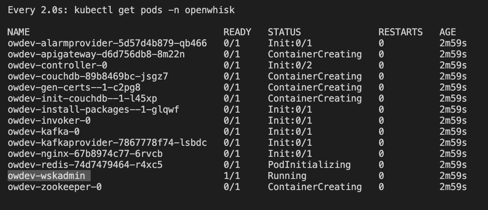

# Deploy OpenWhisk on Minikube

## Install Minikube

[Guide](https://github.com/kubernetes/minikube)

```
$ minikube start --cpus 2 --memory 4096
```

> Increase docker memory limit in advance

## Install Helm
...

## Clone K8s deploy files

```bash
$ git clone https://github.com/apache/openwhisk-deploy-kube
$ vim mycluster.yaml
```

## Manual Installation

```
$ cd openwhisk-deploy-kube/helm/openwhisk
```

### Create Namespace

```
$ kubectl create namespace openwhisk
$ kubectl label nodes --all openwhisk-role=invoker
```

```
$ kubectl get pods -n kube-system
$ kubectl create clusterrolebinding tiller-cluster-admin --clusterrole=cluster-admin --serviceaccount=kube-system:default
```

### Helm

```
$ cd charts
$ helm install . --namespace=openwhisk -f mycluster.yaml --generate-name
```

## Install from git

```
helm install owdev ./openwhisk-deploy-kube/helm/openwhisk -n openwhisk --create-namespace -f mycluster.yaml
```

## Automated installation

```
$ helm repo add openwhisk https://openwhisk.apache.org/charts
$ helm repo update
$ helm install owdev openwhisk/openwhisk -n openwhisk --create-namespace -f mycluster.yaml
```


```yml
whisk:
  ingress:
    type: NodePort
    apiHostName: localhost
    apiHostPort: 31001
    useInternally: false

nginx:
  httpsNodePort: 31001

# A single node cluster; so disable affinity
affinity:
  enabled: false
toleration:
  enabled: false
invoker:
  options: "-Dwhisk.kubernetes.user-pod-node-affinity.enabled=false"
```
## Check

```
$ kubectl get pods -n openwhisk
```

## WSK CLI

URL

```
$ wsk property set --apihost http://localhost:31001
```

Key

```
$ kubectl get pods -n openwhisk
$ kubectl -n openwhisk  -ti exec owdev-wskadmin -- wskadmin user list guest
23bc46b1-71f6-4ed5-8c54-816aa4f8c502:123zO3xZCLrMN6v2BKK1dXYFpXlPkccOFqm12CdAsMgRU4VrNZ9lyGVCGuMDGIwP
```
> owdev-wskadmin is the admin pod's name



```
$ wsk property set --auth 23bc46b1-71f6-4ed5-8c54-816aa4f8c502:123zO3xZCLrMN6v2BKK1dXYFpXlPkccOFqm12CdAsMgRU4VrNZ9lyGVCGuMDGIwP
```


```
$ wsk -i list
```