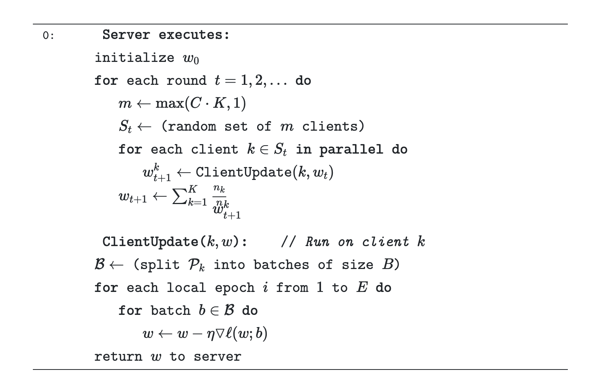
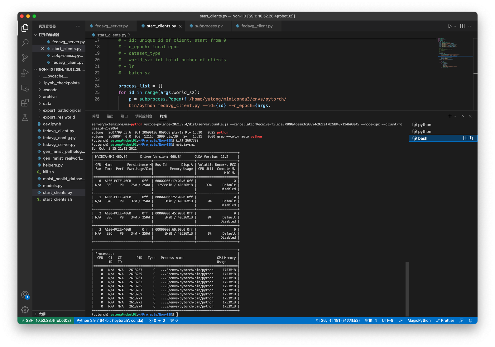
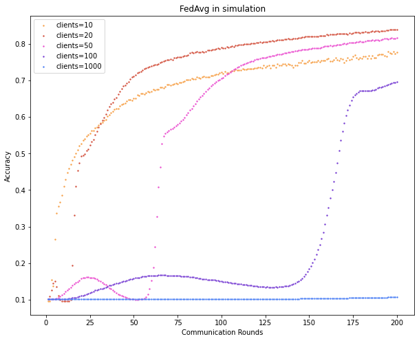
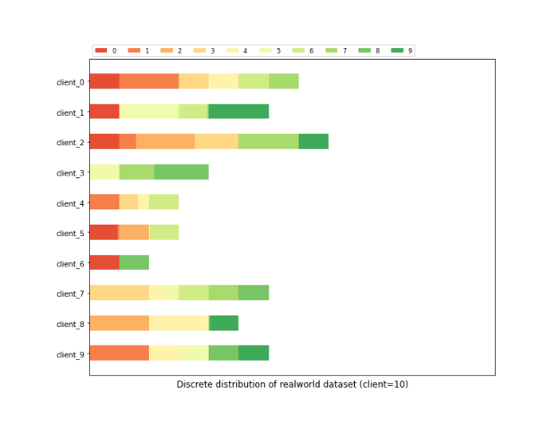
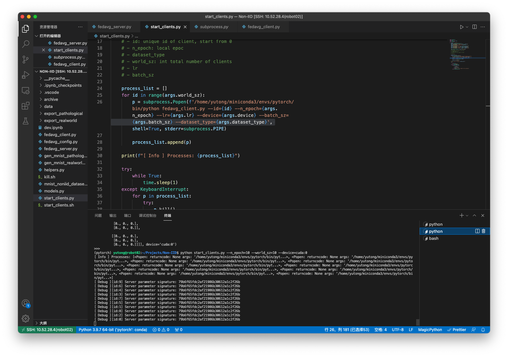
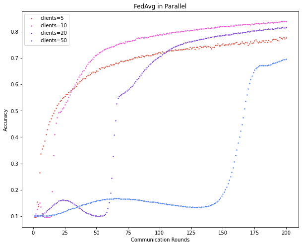

# FedAvg

## Realize a FedAvg algorithm



### Idea - Singal thread Emulator

Follow the paper, we can easily come up with pseudo code

```python
# Creae Server and Clients
server = Server(...)
client_datasets = [Dataset[id, ...] for id in range(N_CLIENTS)]
clients = [Client(id, ...) for id in range(N_CLIENTS)]

server.init(...) # Initialize Server
for loop in range(N_LOOP):
    for id in range(N_CLIENTS):
        # Let client paramter equals to server parameter
        clients[id].parameters = server.parameters
        # Each client train its parameter with local data
        clients[id].train_with(client_datasets[id], ...)
        # Server collects new parameter from clients
        server.new_parameters[id] = clients[id].parameters
    # Optimize server parameters based on collected parameters
    server.parameters = optimize(server.new_parameters)
```

After some work with PyTorch, we can soon finish our training script.

```python
"""run_sim.py
"""
...
def train_async(client: ClientSim, server_params: Dict[str, torch.Tensor],
                dataset: Dataset) -> Tuple[float, Dict[str, torch.Tensor]]:
    logging.info(f'Training client {client.id}')
    client.new_parameters = server_params
    # Each client train its parameter with local data
    client(dataset)
    # Server collects new parameter from clients
    return len(client), client.parameters


def main(args: argparse.Namespace):
    # Initialize server
    server = ServerSim(LeNet5(), device=torch.device(args.s_device))
    # Parse devicese.g. --c_device=cuda:0,cuda:1 -> ['cuda:0','cuda:1']
    c_devices = [torch.device(dev_str) for dev_str in args.c_device.split(',')]
    # Creating client backends. They are executer of clients
    client_backends = [ClientSimBackend(id=idx, net=server.net, device=c_devices[idx]) for idx in range(len(c_devices))]
    # Creating clients. Each client is assigned to a backend
    clients = [
        ClientSim(id=idx,
                  backend=client_backends[idx % len(client_backends)],
                  n_epochs=args.n_epochs,
                  batch_sz=args.batch_sz,
                  lr=args.lr,
                  criterion=torch.nn.functional.cross_entropy,
                  optim=torch.optim.SGD) for idx in range(args.world_sz)
    ]
        # Initialize dataset classes
    client_datasets = [
        MNISTNonIID(f'./export_{args.dataset_type}/mnist_{args.world_sz}/client_{idx}.pkl', device=clients[idx].device) for idx in range(args.world_sz)
    ]

    # Loop for n_sim times
    for sim_idx in range(1, args.n_sim + 1):
        # Temporarily cache server parameters
        server_params = server.parameters
        with tqdm.tqdm(range(args.world_sz), nrows=2) as pbar:
            # Slice clients and cilent_datasets to len(client_backends)
            for batch_clients, batch_dataset in zip(partition(clients, len(client_backends)),
                                                    partition(client_datasets, len(client_backends))):
                # Each client train seperately using threadpool
                executor = ThreadPoolExecutor(max_workers=len(client_backends))
                tasks = [
                    executor.submit(train_async,
                        batch_clients[idx],
                        server_params,
                        batch_dataset[idx],
                    ) for idx in range(len(batch_dataset))
                ]
                for future in as_completed(tasks):
                    res = future.result()
                    server[res[0]] = res[1]
                pbar.set_description(f'sim: {sim_idx}, client: {id}, world_sz:{args.world_sz}')
                pbar.update()
        # Optimize server parameters based on collected parameters
        server()
        test(str(args.world_sz), sim_idx, server.net, server.device)


def test(text: str, epoch_idx: int, net: nn.Module, device: torch.device = torch.device('cpu')) -> None:
    """Server tests model with the emtire dataset

    Args:
        net (nn.Module): Network
        device (torch.device, optional): Device to test model. Defaults to torch.device('cpu').
    """
    BATCH_SZ_TEST: int = 16

    net.to(device)
    net.eval()

    test_loader = DataLoader(MNIST('./data/',
                                   train=False,
                                   download=True,
                                   transform=torchvision.transforms.Compose([
                                       torchvision.transforms.ToTensor(),
                                       torchvision.transforms.Normalize((0.1307, ), (0.3081, ))
                                   ])),
                             batch_size=BATCH_SZ_TEST,
                             shuffle=True)

    acc_cnt: int = 0
    tot_cnt: int = 1e-5

    with tqdm.tqdm(range(len(test_loader))) as pbar:
        for batch_idx, (stimulis, label) in enumerate(test_loader):
            pred = net(stimulis.to(device))
            pred_decoded = torch.argmax(pred, dim=1)
            acc_cnt += (pred_decoded == label.to(device)).sum().detach().cpu().numpy()
            tot_cnt += pred_decoded.size(0)
            pbar.set_description("acc:{}".format(acc_cnt / tot_cnt))
            pbar.update(1)

    with open(f'./logs/log_sim_n:{text}.txt', 'a+') as f:
        f.write(f'{epoch_idx},{acc_cnt / tot_cnt}\n')


if __name__ == '__main__':
    # mp.set_start_method('spawn')
    parser = argparse.ArgumentParser()
    parser.add_argument('--world_sz', type=int, help='Number of clients')
    parser.add_argument('--n_sim', type=int, default=1, help='Number of simulation loops')
    parser.add_argument('--s_device', type=str, default='cpu', help='Device to put server parameters')

    parser.add_argument('--n_epochs', type=int, default=1, help='Number of loops on client side')
    parser.add_argument('--dataset_type', type=str, default='pathological', help='pathological | realworld')
    parser.add_argument('--lr', type=float, default=1e-4, help="Learning rate")
    parser.add_argument('--batch_sz', type=int, default=32, help="Batch size")
    parser.add_argument('--c_device', type=str, default='cpu', help="Device to put client parameters")
    parser.add_argument('--n_multiplex', type=int, default=1, help="Reuse gpu for multiple client")

    args = parser.parse_args()
    # Run main with asyncio
    main(args)
```

### Intepretation

To accelerate training, multi-threading is used. During simulation, multiple client backend are created. A backend can be shared by multiple client. A thread pool in which the number of worker is decided by number of backend will apply trainning funciton on each client in parallel.

> Python's multi-threading cannot run multiple thread at same time due to GIL lock. However, we are in the case of CUDA computing. In CUDA computing, the CPU waits for a period of time after starting CUDA tasks then retrieve results from GPU. We can make use of this period to start tasks on other GPUs

### Client design

The `ClientSim` class is an abstraction of client. It is benifited from many python features:

- `client.__len__` is overided so that `len(client)` will return the length of dataset assigned
- setting `client.new_parameter = value` attribute is actually setting `client.backend.new_parameter  = value` which is actually setting `client.backend.net.load_state_dict(value)`
- `client.parameters` will return `client.backedn.net.state_dict()`
- `client(dataset)` will immediately start training with `dataset`

```python
class ClientSimBackend(object):
    def __init__(self, id: int, net: nn.Module, device: Union[str, torch.device]) -> None:
        """Backend of a client. Since we only have limited GPUs.
        Multiple client can share one backend.
        

        Args:
            id (int): [description]
            net (nn.Module): [description]
            device (Union[str, torch.device]): [description]
        """
        super().__init__()
        self.id: int = id
        self.net: nn.Module = deepcopy(net.cpu())
        self.device: torch.device = device if isinstance(device, torch.device) else torch.device(device)
        self.net.to(self.device)
        self.lock = Lock()

    def __repr__(self) -> str:
        return f'<class: {ClientSimBackend}, id: {self.id}, device:{self.device}'

    @property
    def parameters(self):
        return bundle_parameter(self.net)

    def __call__(self, dataset: Dataset, n_epochs: int, batch_sz: int, lr: float, criterion: Callable,
                 optim: torch.optim.Optimizer) -> Any:
        if self.net is None:
            logging.warn(f'client {self.id} has not initialized net')
            return
        self.lock.acquire()
        self.net.to(self.device)
        self.net.train()

        self.length = len(dataset)
        trainloader = DataLoader(dataset=dataset, batch_size=batch_sz, shuffle=True, num_workers=0)

        optimizer: torch.optim.Optimizer = optim(self.net.parameters(), lr=lr)
        with tqdm.tqdm(len(trainloader) * n_epochs) as pbar:
            for epoch_idx in range(n_epochs):
                for stimulis, labels in trainloader:
                    pred: torch.Tensor = self.net(stimulis.to(self.device))
                    loss: torch.Tensor = criterion(pred, labels.to(self.device))
                    loss.backward()
                    optimizer.step()
                    optimizer.zero_grad()
                    pbar.set_description(f'id: {self.id}, epoch: {epoch_idx}, loss: {str(loss.detach().cpu().numpy())[:6]}')
                    pbar.update()

        del trainloader
        self.lock.release()

    def __len__(self):
        return self.length

    def __setattr__(self, name: str, value: Any) -> None:
        if name == 'new_parameters':
            self.lock.acquire()
            if isinstance(value, nn.Module):
                self.net.load_state_dict(deepcopy(value.state_dict()))
                self.net.to(self.device)
                self.lock.release()
                return
            elif isinstance(value, dict) or isinstance(value, OrderedDict):
                self.net.load_state_dict(deepcopy(value))
                self.net.to(self.device)
                self.lock.release()
                return
            self.lock.release()
            
        return super().__setattr__(name, value)


class ClientSim(object):
    def __init__(self, id: int, backend: ClientSimBackend, n_epochs: int, batch_sz: int, lr: float, criterion: nn.Module,
                 optim: torch.optim.Optimizer) -> None:
        super().__init__()
        self.id: int = id
        self.backend: ClientSim = backend
        self.n_epochs: int = n_epochs
        self.batch_sz: int = batch_sz
        self.lr: float = lr
        self.criterion: Callable = criterion
        self.optim: torch.optim.Optimizer = optim
        self.length: int = 0

    def __repr__(self) -> str:
        return f'<class: {ClientSim}, id: {self.id}, device:{self.backend.device}'

    @property
    def device(self) -> torch.device:
        return self.backend.device
    
    @property
    def parameters(self) -> Dict[str, torch.Tensor]:
        return self.backend.parameters

    def __call__(self, dataset: Dataset) -> Any:
        self.length = len(dataset)

        return self.backend(dataset, self.n_epochs, self.batch_sz, self.lr, self.criterion, self.optim)

    def __len__(self):
        return self.length

    def __setattr__(self, name: str, value: Any) -> None:
        if name == 'new_parameters':
            self.backend.new_parameters = value
        return super().__setattr__(name, value)
```

### Server design

The `ServerSim` class is an abstraction of server. It is benifited from many python features:

- `server.__setitem__` is overided so that `server[client_lengh] = parameters` will add a record of client parameters to cache
- `server()` will immediately start optimizing server parameters with cached client parameters

```python
"""server.py
"""
...

class ServerSim(object):
    def __init__(self, net: nn.Module, device: Union[str, torch.device]) -> None:
        super().__init__()
        self.net: nn.Module = net
        self.device: torch.device = device if isinstance(device, torch.device) else torch.device(device)
        self.net.to(device)
        self.net.eval()
        self.cached_params: List[List[float, Dict[str, torch.Tensor]]] = []
        self.empty_params: OrderedDict = OrderedDict()

        for name, param in list(self.net._named_members(lambda module: module._parameters.items())):
            self.empty_params[name] = torch.zeros_like(param)

    @property
    def parameters(self):
        return bundle_parameter(self.net)

    @torch.no_grad()
    def __call__(self) -> None:
        if len(self.cached_params) <= 0:
            return None

        tot_samples: int = sum([self.cached_params[i][0] for i in range(len(self.cached_params))])
        print(f'[ Info ] Total number of samples: {tot_samples}')
        for idx in range(len(self.cached_params)):
            self.cached_params[idx][0] /= tot_samples

        # Prepare an OrderedDict for result
        new_params = deepcopy(self.empty_params)

        # Gather all model parameters
        for gain, cached_param in self.cached_params:
            for name in new_params.keys():
                new_params[name] += cached_param[name].to(self.device) * gain

        self.net.load_state_dict(new_params)
        print('[ Debug ] New params loaded')

        # Clean cache
        self.cached_params = []

    def __setitem__(self, key: Hashable, value: Any) -> None:
        self.cached_params.append([key, value])
        return None

```

## Non-IID dataset

We designed two functions `sort_mnist()` `break_into()` to split MNIST dataset into pathological and realworld datasets.

```python
def sort_mnist() -> Tuple[torch.Tensor, torch.Tensor]:
    dataset = torchvision.datasets.MNIST('./data/',
                                     train=True,
                                     download=True,
                                     transform=torchvision.transforms.Compose([
                                         torchvision.transforms.ToTensor(),
                                         torchvision.transforms.Normalize((0.1307, ), (0.3081, ))
                                     ]))
    res_stimulis: torch.Tensor = torch.zeros(size=(10, 7000, 1, 28, 28), dtype=torch.float32)
    res_labels: torch.Tensor = torch.zeros(size=(10, 7000), dtype=torch.float32)
    res_index: torch.Tensor = torch.zeros(size=(10,),dtype=torch.int64)
    dataloader = torch.utils.data.DataLoader(dataset, shuffle=True)

    with tqdm.tqdm(dataset) as pbar:
        for item in dataset:
            label = item[1]
            res_stimulis[label, res_index[label],:,:,:] = item[0]
            res_labels[label, res_index[label]] = label
            res_index[label] += 1
            pbar.update()

    res_stimulis_all: torch.Tensor = torch.cat([res_stimulis[idx, 0:res_index[idx],...] for idx in range(10)])
    res_labels_all: torch.Tensor = torch.cat([res_labels[idx, 0:res_index[idx],...] for idx in range(10)]).to(torch.int64)

    return res_stimulis_all, res_labels_all

def break_into(n,m) -> List[List[int]]:
    """
    return m random integers with sum equal to n 
    """
    distribution = [1 for i in range(m)]

    for i in range(n-m):
        ind = random.randint(0,m-1)
        distribution[ind] += 1

    index = [i for i in range(n)]
    random.shuffle(index)

    res = [[] for i in range(m)]
    tmp: int = 0
    for idx, bin in enumerate(distribution):
        res[idx] += index[tmp: tmp + bin]
        tmp += bin

    return res
```

### gen_mnist_pathological.py

```python
"""gen_mnist_pathological.py
"""
import torch
import random
from typing import List
import pickle
import sys, os
from helpers import sort_mnist

if __name__ == '__main__':
    n_client: int = int(sys.argv[1]) if len(sys.argv) > 1 else 10

    res_stimulis_all, res_labels_all = sort_mnist()
    n_patches: int = n_client * 2
    patch_sz = 60000 // n_patches
    data_assignment: List[int] = list(range(n_patches))
    random.shuffle(data_assignment)
    export_dir = f'./export_pathological/mnist_{n_client}'
    
    if not os.path.exists(export_dir):
        os.mkdir(export_dir)

    for client_id in range(n_client):
        patch_idx_1 = data_assignment[client_id * 2]
        patch_idx_2 = data_assignment[client_id * 2  + 1]

        stimulis_tmp = torch.cat([
            res_stimulis_all[patch_idx_1 * patch_sz:(patch_idx_1 + 1) * patch_sz, ...],
            res_stimulis_all[patch_idx_2 * patch_sz:(patch_idx_2 + 1) * patch_sz, ...]
        ])
        labels_tmp = torch.cat([
            res_labels_all[patch_idx_1 * patch_sz:(patch_idx_1 + 1) * patch_sz, ...],
            res_labels_all[patch_idx_2 * patch_sz:(patch_idx_2 + 1) * patch_sz, ...]
        ]).to(torch.int64)

        data = {'stimulis': stimulis_tmp, 'labels': labels_tmp}
        with open(f'{export_dir}/client_{client_id}.pkl', 'wb') as f:
            pickle.dump(data, f)
```

### gen_mnist_realworld.py

```python
"""gen_realworld_pathological.py
"""
import torch
import pickle
import sys, os
from helpers import sort_mnist, break_into

if __name__ == '__main__':
    n_client: int = int(sys.argv[1]) if len(sys.argv) > 0 else 10

    res_stimulis_all, res_labels_all = sort_mnist()
    n_patches = 5 * n_client
    patch_sz = 60000 // n_patches
    data_assignment = break_into(n_patches, n_client)
    export_dir = f'./export_realworld/mnist_{n_client}'

    if not os.path.exists(export_dir):
        os.mkdir(export_dir)
        
    for client_id in range(n_client):
        stimulis_tmp = torch.cat([
            res_stimulis_all[patch_idx * patch_sz:(patch_idx + 1) * patch_sz, ...] for patch_idx in data_assignment[client_id]
        ])
        labels_tmp = torch.cat([
            res_labels_all[patch_idx * patch_sz:(patch_idx + 1) * patch_sz, ...] for patch_idx in data_assignment[client_id]
        ]).to(torch.int64)
        data = {'stimulis': stimulis_tmp, 'labels': labels_tmp}
        with open(f'{export_dir}/client_{client_id}.pkl', 'wb') as f:
            pickle.dump(data, f)
```

### Explanation

The MNIST is converted to serialized pkl objects. They are stored at `./export_{dataset_type}/mnist_{n_client}/client_{id}.pkl` Each dataset file can be deserialized to a python dictionary:

```json
{
    "stimulis": torch.Tensor(size=(n,1,28,28), dtype=float32),
    "labels":torch.Tensor(size=(n,1), dtype=int64)
}
```

To read this dataset, an `MNIST_NonIID` class is created.

```python
"""mnist_noniid_dataset.py
"""
import torch
from torch.utils.data import Dataset
import pickle
from typing import Any

class MNISTNonIID(Dataset):
    stimulis: torch.Tensor = None
    labels: torch.Tensor = None
    length: int = 0
    def __init__(self, path_to_pkl: str) -> None:
        super().__init__()
        with open(path_to_pkl, 'rb') as f:
            data = pickle.load(f)

        self.stimulis = data['stimulis']
        self.labels = data['labels']
        self.length = len(self.stimulis)
    def __len__(self):
        return self.length
    
    def __getitem__(self, index) -> Any:
        return self.stimulis[index,...], self.labels[index]
```

## Impact of number of clients on accuracy

In this experiment, we study the effect of number of clients on model accuracy.

We use `torch.random.manual_seed(0)` to ensure that neural network is initialized identically across experiments.

We run **200** loops of optimization on the server side. During each loop, the clients opimize their models **8** times locally. The gradient descend algorithm is **SGD**, with batch size equals to **32** and learning rate equals to **1e-4**.

The experiment is carried out on a Server with following configuration:

- 4x Xeon Platium 8276L CPU, 224 cores
- 512GB RAM
- 4x Nvidia A100 GPU

There are only 4 GPUs, thus we assign client N to GPU `mod(N,4)`. Based on previous experiments, 10 clients can stress a single A100 very will, although its graphic memory is still redundant。



### Experimental results

The relationship between accuracy, count of communication rounds and number of clients is shown in the Figure



## Optimizing communication

Realworld dataset is used for this experiment. A jupyter notebook is invented to verify the distribution generated dataset.

To run this notebook, `ipykernel` and `jupyter` must be installed. Plus, to visualize dataset, **matplotlib** is neccessary.



We also need to come up with a method so that multiple client can communicate with server.
Our solution is **shared memory**.

### Idea - Multi process FedAvg

We first define some signals

| Singals | Signification |
|---|---|
|`SIG_INIT`| The initial state|
|`SIG_S_READY`| Parameter is ready on the server side|
|`SIG_S_BUSY`| The server is computing new parametsers|
|`SIG_S_ERROR`| (Unused)|
|`SIG_S_QUERY`| (Unused)|
|`SIG_S_CLOSE`| Server shutdown|
|`SIG_C_READY`| The client has finished train loop|
|`SIG_C_BUSY`| The client is tranning|
|`SIG_C_ERROR`|(Unused)|
|`SIG_C_CLOSE`|The client say goodbye to server|

### Server logics

- We Use `mmap` shared memory to share parameters / variables
- Each client has an unique id
- `/tmp/fedavg_client_{id}_signal.mmap` is used to sync clients and server
- Server push model parameters to shared memory `/tmp/fedavg_server_params.mmap`. Then, Server publishes the signal as `SIG_S_READY` to all clients
- Server then watch for signal from clients. When the signal turns to `SIG_C_READY`, Server will mark the client as finished. Server will stop watching after all clients have finished or timeout.
- Server set signal to `SIG_S_BUSY`. Then, Server pull client paramters via `/tmp/fedavg_client_{id}_params.mmap` and client info (length of dataset) via `/tmp/fedavg_client_{id}_info.mmap`
- Server calculates the averaged parameters and publish this paramter to shared memory. Then, Server publishes signal `SIG_S_READY` to all clients.

### Client logics

- Client watch for signal from Server. When it turns to `SIG_S_READY`, Client will pull parameters from server via `/tmp/fedavg_server_params.mmap`
- Client set signal to `SIG_C_BUSY`
- Client train model with pulled paramters and local data
- Client post local model parameters to `/tmp/fedavg_client_{id}_params.mmap`, and length of dataset to `/tmp/fedavg_client_{id}_info.mmap`
- Client set signal to `SIG_C_READY`
- Client watch for singal from Server, if it is `SIG_S_READY`, another loop will launch

### Abstraction of shared memory

To better accomplish our task, we created ConnABC abstraction of shared memory

```python
class ConnABC(object):
    def __init__(self, path: str, size: int=0, mult:int=2) -> None:
        super().__init__()
        self.mult: int = mult # Multiplier of size. RealSize = Size * Multiplier
        self.path: str = path # Mapped path of shared memory
        self.size: int = size # Size of memory. When size==0, the connection will be set upon an existing file
        self.closed: bool = True
        self.open()

    def open(self):
        """Start connection
        """
        if self.closed:
            self._create_mmap()

    def _create_mmap(self) -> None:
        """Create mmap
        The server is responsible of creating mmap files. It must decide the size of share memory

        The client, on the other hand, open a mmap file directly. So size==0 on the client size, and the client should not create new file on disk
        """

        # Creating an empty file on disk
        if self.size > 0:
            with open(self.path, 'wb') as f:
                f.write(bytearray(itertools.repeat(0, int(self.size * self.mult))))
        
        # Open the file and mmap
        self.fd = open(self.path, 'r+b')
        self.mmap = mmap.mmap(self.fd.fileno(), 0, mmap.MAP_SHARED)
        self.size = self.mmap.size()
        self.closed = False
    
    
    def set(self, obj: Any, encode:bool=True) -> bool:
        """Set the content of shared memory to an object

        Args:
            obj (Any): bytes array or other types of object
            encode (bool, optional): Encode the object or not. Defaults to True.

        Raises:
            BufferError: The object exceeds size limit

        Returns:
            bool: Status
        """

        # If encode is True, encode the object with pickle
        if encode:
            obj_ser = pickle.dumps(obj)
        else:
            obj_ser = obj
        if len(obj_ser) > self.size:
            raise BufferError(f'Oversized object {len(obj_ser)} exceed limit of {self.size}')
        
        self.mmap.seek(0) # Remember to seek(0)
        self.mmap.write(obj_ser)
        return True

    def get(self, decode: bool=True) -> Any:
        """Get object from shared memory

        Args:
            decode (bool, optional): Decode the object or not. Defaults to True.

        Returns:
            Any: Result
        """
        self.mmap.seek(0) # Remember to seek(0)

        # # If decode is True, decode the object with pickle
        if decode:
            return pickle.loads(self.mmap.read())
        else:
            return self.mmap.read()

    
    def close(self):
        """Shut the connection down gracefully
        """
        if not self.mmap.closed:
            self.mmap.close()
        
        if not self.fd.closed:
            self.fd.close()
        
        self.closed = True
```

That's it. Simply, `ConnABC(path, size)` will create a piece of shard memory mapped to path. `ConnABC` does not require any libraries other than python standard libraies.

### Server Class

```python
class ServerABC(object):
    def __init__(self, *args, **kwargs) -> None:
        """Server abstraction
        """
        super().__init__()

        # Server information maintained
        self.net: nn.Module = None
        self.params_size: int = None
        self.shared_params: ConnABC = None
        self.status: int = SIG_INIT

        # Client information maintained
        self.client_ids: List[int] = []
        self.client_params: Dict[int, ConnABC] = dict()
        self.client_info: Dict[int, ConnABC] = dict()
        self.client_signal: Dict[int, ConnABC] = dict()

    def get_client_params_path(self, id: int) -> str:
        return os.path.join(MMAP_PATH, CLIENT_PARAMS_FILEDESC.format(id))

    def get_client_signal_path(self, id: int) -> str:
        return os.path.join(MMAP_PATH, CLIENT_SIGNAL_FILEDESC.format(id))

    def get_client_info_path(self, id: int) -> str:
        return os.path.join(MMAP_PATH, CLIENT_INFO_FILEDESC.format(id))

    def get_client_params(self, id: int) -> OrderedDict:
        """Get model parameters from client[id]

        Args:
            id (int): Unique id of client

        Returns:
            OrderedDict: Model paramters
        """
        params = self.client_params[id].get()
        return params

    def get_client_signal(self, id: int) -> int:
        """Get signal from client[id]

        Args:
            id (int): Unique id of client

        Returns:
            int: Signal
        """
        signal = self.client_signal[id].get(decode=False)[0]
        return signal

    def get_client_info(self, id: int) -> int:
        """Get info from client[id]

        Args:
            id (int): Unique id of client

        Returns:
            int: Length of dataset
        """
        info = self.client_info[id].get()
        return int(info.detach().cpu().numpy())

    def register_net(self, net: nn.Module):
        """Register an nn.Module to server

        Args:
            net (nn.Module): the neural network
        """
        self.net = net
        self.params_size = len(pickle.dumps(self.net.state_dict()))
        self.shared_params = ConnABC(os.path.join(MMAP_PATH, SERVER_PARAMS_FILEDESC), self.params_size, 2)
        self.publish_net()

    def publish_net(self):
        """Actually publish net parameters
        The parameters are from self.net
        """
        self.shared_params.set(self.net.state_dict())

    def register_client(self, id: int) -> bool:
        """Register client to server.

        Args:
            id (int): Unique id of client

        Returns:
            bool: status code
        """

        # Avoid duplicate clients
        if id in self.client_ids:
            print("[ Error ] Client already registered")
            return False

        # Complete client registration
        self.client_ids.append(id)
        self.client_params[id] = ConnABC(self.get_client_params_path(id), self.params_size)
        self.client_signal[id] = ConnABC(self.get_client_signal_path(id), 1)
        self.client_info[id] = ConnABC(self.get_client_info_path(id), len(pickle.dumps(torch.tensor(0, dtype=torch.int64))))
        self.client_signal[id].set(bytearray([self.status]), encode=False)
        self.client_info[id].set(torch.tensor(0, dtype=torch.int64))
        return True
    
    def unregister_client(self, id: int) -> bool:
        """Unregister client from server.

        Args:
            id (int): Unique id of client

        Returns:
            bool: status code
        """
        if id not in self.client_ids:
            print("[ Error ] Client not registered")
            return False
        
        self.client_ids.remove(id)
        if not self.client_params[id].closed:
            self.client_params[id].close()
        
        if not self.client_signal[id].closed:
            self.client_signal[id].close()

        if not self.client_info[id].closed:
            self.client_info[id].close()

        self.client_params.pop(id)
        self.client_signal.pop(id)
        self.client_info.pop(id)

    def publish_signal(self, signal: int=None):
        """Publish a signal, to ALL clients

        Args:
            signal ([int], optional): Signal. Defaults to None.
        """
        # Use self.status if signal is None
        if signal is not None:
            self.status = signal
        for client_id in self.client_ids:
            # Signals are raw bytes, do not encode
            self.client_signal[client_id].set(bytearray([self.status]), encode=False)
    
    def send_signal(self, id: int, signal: int):
        """Send a signal to client[id]

        Args:
            id (int): Unique id of client
            signal (int): The signal
        """
        # Signals are raw bytes, do not encode
        self.client_signal[id].set(bytearray([signal]), encode=False)

    def wait_clients(self, timeout=1e3) -> List[int]:
        """Wait for clients to complete trainning

        Args:
            timeout ([type], optional): Timeout. Defaults to 1e3.

        Returns:
            List[int]: List of accomplished clients
        """
        start_time = time.time()
        ready_clients: List[int] = []
        while time.time() < start_time + timeout:
            if len(ready_clients) == len(self.client_ids):
                break
            for client_id in self.client_ids:
                signal = self.client_signal[client_id].get(decode=False)[0]
                if signal == SIG_C_READY:
                    if client_id not in ready_clients:
                        ready_clients.append(client_id)
                        start_time = time.time()
            time.sleep(1e-1)
        return ready_clients
    
    def close(self) -> None:
        """Close server and release resources
        """
        if not self.shared_params.closed:
            self.shared_params.close()

        for client_id in self.client_ids:
            if not self.client_params[client_id].closed:
                self.client_params[client_id].close()
            if not self.client_signal[client_id].closed:
                self.client_signal[client_id].close()

    def optimize(self, ready_clients: List[int] = None) -> None:
        """Optimize self.net using parameters collected

        Args:
            clients (List[int], optional): Finished clients. Defaults to None.
        """
        # Use data from all clients
        if ready_clients is None:
            ready_clients = self.client_ids

        # Gather client.info (client.dataset_len) and calculate total number of samples and gain for each client
        tot_samples: int = 0
        client_gain: Dict[int, float] = dict()
        for client_id in ready_clients:
            curr_info = self.get_client_info(client_id)
            tot_samples += curr_info
            client_gain[client_id] = curr_info
        print(f'[ Info ] Total number of samples: {tot_samples}')
        for key in client_gain.keys():
            client_gain[key] /= tot_samples

        # Prepare an OrderedDict for result
        new_params = OrderedDict()
        target_names: List[str] = []
        for name, _ in list(self.net._named_members(lambda module: module._parameters.items())):
            new_params[name] = 0
            target_names.append(name)

        # Gather all model parameters
        for client_id in ready_clients:
            curr_param = self.get_client_params(client_id)
            for name in new_params.keys():
                new_params[name] += curr_param[name] * client_gain[client_id]
        
        # Check if the state dict is valid
        if verify_state_dict(target_names, new_params):
            self.net.load_state_dict(new_params)
            print('[ Debug ] New params loaded')
        
        # Publish the net
        self.publish_net()

    def serve(self, n_epochs: int) -> bool:
        """Server start serving, for n epochs

        Args:
            n_epochs (int): n epochs

        Returns:
            (bool): status code
        """
        if self.net is not None:
            self.publish_signal(SIG_S_READY)
        else:
            self.publish_signal(SIG_INIT)
            return False

        for epoch_idx in range(1, n_epochs + 1):
            print(f'[ Info ] Loop {epoch_idx}')
            # Print signature of model parameters for verification
            print(f'[ Debug ] Model parameter signature: {md5(self.shared_params.get(decode=False)).hexdigest()}') 
            # print(f'[ Debug ] Parameters: {self.net.state_dict()}')
            print(f'[ Info ] Clients: {self.client_ids}')
            ready_clients: List[int] = self.wait_clients()
            if len(ready_clients) == 0:
                self.publish_signal(SIG_S_CLOSE)
                time.sleep(1)
                return False
            
            self.publish_signal(SIG_S_BUSY)
            self.optimize(ready_clients=ready_clients)
            if epoch_idx < n_epochs:
                self.publish_signal(SIG_S_READY)
            else:
                self.publish_signal(SIG_S_CLOSE)
        return True
```

### Client Class

```python
class ClientABC(object):
    def __init__(self, id: int, *args, **kwargs) -> None: 
        """# Client abstraction

        Args:
            id (int): client unique id
        """
        super().__init__()
        self.id: int = id
        self.status: int = None # Client status
        self.signal: ConnABC = None # Client signal, shared with server
        self.server_params: ConnABC = None # Server params, read-only
        self.client_params: ConnABC = None # Client params, shared with server, write-only
        self.client_info: ConnABC = None # Client signal, shared with server, read-write
        self.closed: bool = True

    @property
    def server_params_path(self) -> str:
        return os.path.join(MMAP_PATH, SERVER_PARAMS_FILEDESC)

    @property
    def client_params_path(self) -> str:
        return os.path.join(MMAP_PATH, CLIENT_PARAMS_FILEDESC.format(self.id))
    
    @property
    def client_info_path(self) -> str:
        return os.path.join(MMAP_PATH, CLIENT_INFO_FILEDESC.format(self.id))

    @property
    def signal_path(self) -> str:
        return os.path.join(MMAP_PATH, CLIENT_SIGNAL_FILEDESC.format(self.id))

    def set_signal(self, signal: int) -> bool:
        """Set the signal of client

        Args:
            signal (int): An integer, see fedavg_config.py

        Returns:
            bool: Status code
        """
        self.status = signal
        # Raw bytes used for signal, do not encode
        self.signal.set(bytearray([signal]), encode=False)
        return True
    
    def get_signal(self) -> int:
        """Get the signal

        Returns:
            int: signal
        """
        # Raw bytes used for signal, do not decode
        return self.signal.get(decode=False)[0]

    def get_params(self) -> OrderedDict:
        """pull params form server

        Returns:
            OrderedDict: state_dict
        """
        params = self.server_params.get()
        return params
    
    def set_params(self, model: nn.Module) -> bool:
        """Push params to shared memory

        Args:
            model (nn.Module): The current model

        Returns:
            bool: Status code
        """
        self.client_params.set(model.state_dict())
        return True
    
    def set_info(self, info: int) -> bool:
        """Set client info (length of dataset)

        Args:
            info (int): The length is an integer

        Returns:
            bool: Status code
        """
        # Warning: pickle does not dump int to a fixed length bytearray, therefore, the length must be converted to torch.tensor
        self.client_info.set(torch.tensor(info, dtype=torch.int64))
        return True

    def open(self) -> None:
        self.client_params = ConnABC(self.client_params_path, 0)
        self.signal = ConnABC(self.signal_path, 0)
        self.server_params = ConnABC(self.server_params_path, 0)
        self.client_info = ConnABC(self.client_info_path, 0)

    def close(self) -> None:
        if not self.client_params.closed:
            self.client_params.close()
        if not self.signal.closed:
            self.signal.close()
        if not self.server_params.closed:
            self.server_params.close()
        if not self.client_info.closed:
            self.client_info.close()
        
        self.closed = True
    
    def wait_server(self) -> int:
        """Endless loop that checks signal from server

        Returns:
            int: signal obtained
        """
        while True:
            signal = self.get_signal()
            if signal == SIG_S_READY or signal == SIG_S_CLOSE or signal == SIG_S_CLOSE:
                return signal

            # time.sleep to avoid high CPU consumption
            time.sleep(1e-1)
```

### server_para.py

We introduced `tqdm` library to better display model evaluation process.

```python
"""server_para.py
"""
import argparse
import torch
import torch.nn as nn
import torchvision
import tqdm

torch.random.manual_seed(0)

from fedavg_config import *
from helpers import ServerABC
from models import ModelABC

def run(args: argparse.Namespace) -> None:
    # Init server
    server = ServerABC()
    # Register bodel
    server.register_net(ModelABC(args))

    client_list = list(range(args.num_clients))
    for client_id in client_list:
        server.register_client(client_id)

    try:
        # Serve model
        server.serve(args.n_epochs)
        test(server.net)
    except KeyboardInterrupt as e:
        server.close()


def test(net: nn.Module, device: torch.device = torch.device('cpu')) -> None:
    """Server tests model with the emtire dataset

    Args:
        net (nn.Module): Network
        device (torch.device, optional): Device to test model. Defaults to torch.device('cpu').
    """
    BATCH_SZ_TEST: int = 16

    net.to(device)
    net.eval()

    test_loader = torch.utils.data.DataLoader(torchvision.datasets.MNIST('./data/',
                                                                         train=False,
                                                                         download=True,
                                                                         transform=torchvision.transforms.Compose([
                                                                             torchvision.transforms.ToTensor(),
                                                                             torchvision.transforms.Normalize((0.1307, ),
                                                                                                              (0.3081, ))
                                                                         ])),
                                              batch_size=BATCH_SZ_TEST,
                                              shuffle=True)

    acc_cnt: int = 0
    tot_cnt: int = 1e-5

    with tqdm.tqdm(range(len(test_loader))) as pbar:
        for batch_idx, (stimulis, label) in enumerate(test_loader):
            pred = net(stimulis)
            pred_decoded = torch.argmax(pred, dim=1)
            acc_cnt += (pred_decoded == label).sum().detach().cpu().numpy()
            tot_cnt += pred_decoded.size(0)
            pbar.set_description("acc:{}".format(acc_cnt / tot_cnt))
            pbar.update(1)


if __name__ == '__main__':
    parser = argparse.ArgumentParser()
    parser.add_argument('--num_clients', type=int)
    parser.add_argument('--n_epochs', type=int, default=1)

    args: argparse.Namespace = parser.parse_args()
    run(args)
    # args have
    # - num_clients: int
    # - n_epochs: int default to 1
```

### client_para.py

```python
"""client_para.py
"""
import argparse
from hashlib import md5

import torch
import torch.nn as nn
from torch.utils import data
from torch.utils.data import DataLoader, Dataset
from torch.optim import Optimizer
import tqdm

from helpers import ClientABC
from models import ModelABC
from fedavg_config import *
from mnist_noniid_dataset import MNISTNonIID

net: nn.Module = None
optimizer: Optimizer = None
criterion: nn.Module = None
dataset: Dataset = None
train_loader: DataLoader = None


def train(args: argparse.Namespace, client: ClientABC) -> None:
    """Basic train loop

    Args:
        args (argparse.Namespace): client arguments
        client (ClientABC): client abstraction
    """
    global net, dataset, optimizer, criterion, train_loader
    net.train()
    device = torch.device(args.device)
    for epoch_idx in range(1, args.n_epoch + 1):
        with tqdm.tqdm(range(len(train_loader))) as pbar:
            for stimuli, label in train_loader:
                optimizer.zero_grad()
                pred = net(stimuli.to(device))
                loss = criterion(pred, label.to(device))
                loss.backward()
                optimizer.step()
                pbar.set_description(f'[ Info ][id:{client.id}] loop={epoch_idx}, loss={loss.detach().cpu().numpy()}')
                pbar.update()

    client.set_info(len(dataset))
    client.set_params(net)
        

def init(args) -> None:
    """Initialize model, optimizer, criterion, dataloader

    Args:
        args ([type]): [description]
    """
    global net, optimizer, criterion, dataset, train_loader

    net = ModelABC()
    device = torch.device(args.device)
    net.to(device)
    dataset = MNISTNonIID(f'./export_{args.dataset_type}/mnist_{args.world_sz}/client_{args.id}.pkl')
    optimizer = torch.optim.SGD(net.parameters(), lr=args.lr)
    criterion = torch.nn.functional.cross_entropy
    train_loader = DataLoader(dataset, batch_size=args.batch_sz, shuffle=True)


def run(args: argparse.Namespace) -> None:
    """Run client

    Args:
        args (argparse.Namespace): Start arguments
    """
    global net

    client = ClientABC(args.id)
    client.open()
    client.wait_server()

    while True:
        params = client.get_params()
        print(f'[ Debug ][id:{client.id}] Server parameter signature: {md5(client.server_params.get(decode=False)).hexdigest()}')
        net.load_state_dict(params)

        client.set_signal(SIG_C_BUSY)
        train(args, client)
        client.set_signal(SIG_C_READY)
        
        signal = client.wait_server()
        if signal == SIG_S_ERROR or signal == SIG_S_CLOSE:
            client.close()
            print(f'[ Info ][id:{client.id}] Client shutdown.')
            return


if __name__ == '__main__':
    parser = argparse.ArgumentParser()
    parser.add_argument('--id', type=int, default=0)
    parser.add_argument('--n_epoch', type=int, default=1)
    parser.add_argument('--dataset_type', type=str, default='pathological')
    parser.add_argument('--world_sz', type=int, default=10)
    parser.add_argument('--lr', type=float, default=1e-4)
    parser.add_argument('--batch_sz', type=int, default=32)
    parser.add_argument('--device', type=str, default='cpu')

    args: argparse.Namespace = parser.parse_args()
    # args have
    # - id: unique id of client, start from 0
    # - n_epoch: local epoc
    # - dataset_type
    # - world_sz: int total number of clients
    # - lr
    # - batch_sz
    init(args)
    run(args)

```

### Helper functions

A set of helper functions are created

```python
def bundle_parameter(net: nn.Module) -> Dict[str, torch.Tensor]:
    parameter_dict = {}
    module_parameters: List[str, nn.parameter.Parameter] = list(net._named_members(lambda module: module._parameters.items()))
    for name, param in module_parameters:
        parameter_dict[name] = param.clone().detach().cpu()
    return parameter_dict

def gen_signature(net: Union[nn.Module, OrderedDict]) -> str:
    if isinstance(net, OrderedDict):
        return md5(pickle.dumps(net)).hexdigest()
    elif isinstance(net, nn.Module):
        return md5(pickle.dumps(net.state_dict())).hexdigest()
    else:
        raise NotImplementedError

def verify_state_dict(names: List[str], state_dict: OrderedDict) -> bool:
    for name in names:
        if name in state_dict.keys() and isinstance(state_dict[name], torch.Tensor):
            pass
        else:
            return False
    return True

```

The source code is included in the submission. It is testted on `Ubuntu20.04LTS` with `Python3.9` and `torch=1.9.1`.

Summary of requirements:

- `torch`
- `torchvision`
- `tqdm`

### Experiment

As shown in the figure, the clients can fetch server parameters in parallel.



The experimental results are shown in the figure below. Due to computational cost, we did not test client=100 and clients=1000



